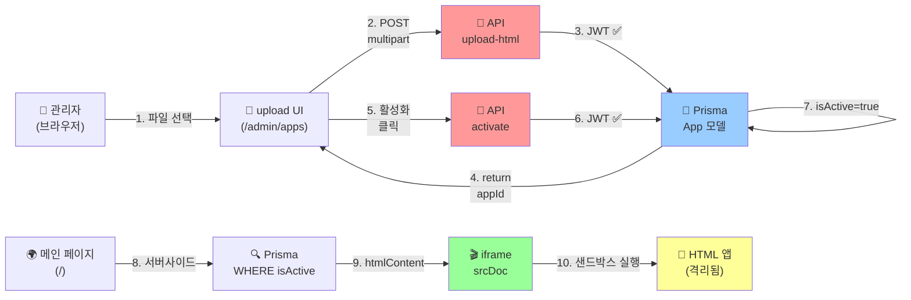

# ✅ HTML 앱 관리 시스템 - 구현 완료 체크리스트

## 📋 생성/수정된 전체 파일 목록

### 1️⃣ 데이터베이스
- ✅ [prisma/schema.prisma](prisma/schema.prisma) - App 모델 추가
- ✅ [prisma/migrations/add_app_model/migration.sql](prisma/migrations/add_app_model/migration.sql) - SQL 마이그레이션

### 2️⃣ 백엔드 API (4개 엔드포인트)
- ✅ [app/api/admin/upload-html/route.ts](app/api/admin/upload-html/route.ts)
  - POST /api/admin/upload-html
  - 기능: HTML 파일 업로드 → DB 저장 → appId, publicUrl 반환
  - 인증: Bearer Token (JWT)

- ✅ [app/api/apps/current/route.ts](app/api/apps/current/route.ts)
  - GET /api/apps/current
  - 기능: 활성화된 앱 정보 조회 (htmlContent 포함)
  - 인증: 없음 (공개 API)

- ✅ [app/api/admin/apps/activate/route.ts](app/api/admin/apps/activate/route.ts)
  - POST /api/admin/apps/activate
  - 기능: 특정 앱 활성화 (메인 페이지에 표시할 앱 선택)
  - 인증: Bearer Token (JWT)

- ✅ [app/api/admin/apps/list/route.ts](app/api/admin/apps/list/route.ts)
  - GET /api/admin/apps/list
  - 기능: 모든 업로드된 앱 목록 조회
  - 인증: Bearer Token (JWT)

### 3️⃣ 프론트엔드 페이지
- ✅ [app/admin/apps/page.tsx](app/admin/apps/page.tsx) - 관리자 페이지
  - 📤 HTML 파일 업로드 UI
  - 📋 업로드된 앱 목록 + 활성화 버튼
  - 토큰: localStorage.getItem('admin_token')에서 조회

- ✅ [components/public/CurrentAppViewer.tsx](components/public/CurrentAppViewer.tsx) - 메인 페이지 뷰어
  - iframe srcDoc으로 htmlContent 렌더링
  - sandbox="allow-scripts allow-forms..." 적용 (쿠키 격리)
  - Props: appId, name, publicUrl, htmlContent

### 4️⃣ 메인 페이지 수정
- ✅ [app/(public)/page.tsx](app/(public)/page.tsx)
  - 활성화된 앱 감지 (서버사이드)
  - 있으면 → CurrentAppViewer로 렌더링
  - 없으면 → 기존 SiteRenderer로 폴백

### 5️⃣ 로그인 페이지 수정
- ✅ [app/admin/login/page.tsx](app/admin/login/page.tsx)
  - 로그인 성공 후 토큰을 localStorage에 저장
  - 코드: `localStorage.setItem('admin_token', data.token)`

### 6️⃣ 관리자 대시보드 수정
- ✅ [app/admin/page.tsx](app/admin/page.tsx)
  - 메뉴에 "🌐 HTML 앱 관리" 링크 추가 → /admin/apps

---

## 🎯 요구사항 완료도

| 요구사항 | 상태 | 파일 | 설명 |
|---------|------|------|------|
| 파일 업로드 UI | ✅ | app/admin/apps/page.tsx | `<input type="file" accept=".html">` |
| 업로드 성공 표시 | ✅ | app/admin/apps/page.tsx | publicUrl을 화면에 표시 |
| POST /api/admin/upload-html | ✅ | app/api/admin/upload-html/route.ts | multipart 처리, DB 저장 |
| 반환값 { appId, publicUrl } | ✅ | app/api/admin/upload-html/route.ts | JSON 응답 |
| 관리자 인증 (JWT) | ✅ | 모든 admin API | Bearer Token 검증 |
| iframe sandbox | ✅ | components/public/CurrentAppViewer.tsx | 보안 속성 설정 |
| 메인에서 앱 자동 표시 | ✅ | app/(public)/page.tsx | 서버사이드 조회 |
| iframe 사용 | ✅ | components/public/CurrentAppViewer.tsx | srcDoc 사용 |
| GET /api/apps/current | ✅ | app/api/apps/current/route.ts | 공개 API |
| POST /api/admin/apps/activate | ✅ | app/api/admin/apps/activate/route.ts | 활성화 기능 |
| DB에 isActive 저장 | ✅ | prisma/schema.prisma | App.isActive boolean |
| 앱 선택/활성화 기능 | ✅ | app/admin/apps/page.tsx | 활성화 버튼 |

---

## 🚀 배포 순서

### 1단계: 마이그레이션 실행
```bash
# .env.local 설정 (DATABASE_URL 필수)
cp .env.example .env.local
# 편집: DATABASE_URL 값 설정

# 마이그레이션 실행
npx prisma migrate deploy

# 또는 개발 환경
npx prisma migrate dev
```

### 2단계: 관리자 계정 생성 (선택)
```bash
npx prisma db seed
```

### 3단계: 애플리케이션 시작
```bash
npm run dev
# http://localhost:3000 에서 접속 가능
```

### 4단계: 관리자 로그인
```
URL: http://localhost:3000/admin/login
이메일: admin@example.com  
비밀번호: strong-initial-password-123
```

---

## 📊 데이터 흐름



---

## 🔒 보안 체크리스트

- ✅ JWT 토큰으로 관리자 인증
- ✅ POST 요청에서 Bearer Token 검증
- ✅ iframe sandbox로 쿠키/localStorage 격리
- ✅ srcDoc 사용 (외부 URL 불필요)
- ✅ allow-same-origin 제거 고려 (필요시)
- ⚠️ CORS 설정 확인 필수

---

## 🧪 테스트 방법

### 수동 테스트

#### 1️⃣ 앱 업로드
```bash
# 로그인 후 /admin/apps 접속
# → "파일 선택" 버튼 클릭
# → NeuroIQ-Pro-Ultimate-v2.html 선택
# → 성공 메시지 확인
# → 목록에서 새 앱 확인
```

#### 2️⃣ 앱 활성화
```bash
# 앱 목록에서 "활성화" 버튼 클릭
# → 상태가 "✅ 활성화"로 변경
```

#### 3️⃣ 메인 페이지 확인
```bash
# "/" 접속
# → iframe이 표시되고 HTML 앱 실행
# → CSS 스타일 적용 확인
# → JavaScript 기능 확인 (실행되어야 함)
```

### API 테스트 (curl)
```bash
# 로그인
TOKEN=$(curl -X POST http://localhost:3000/api/admin/login \
  -H "Content-Type: application/json" \
  -d '{"email":"admin@example.com","password":"..."}' \
  | jq -r '.token')

# 파일 업로드
UPLOAD=$(curl -X POST http://localhost:3000/api/admin/upload-html \
  -H "Authorization: Bearer $TOKEN" \
  -F "file=@app.html")
echo $UPLOAD | jq .

# 앱 ID 추출
APP_ID=$(echo $UPLOAD | jq -r '.appId')

# 앱 활성화
curl -X POST http://localhost:3000/api/admin/apps/activate \
  -H "Authorization: Bearer $TOKEN" \
  -H "Content-Type: application/json" \
  -d "{\"appId\":\"$APP_ID\"}"

# 현재 앱 조회
curl http://localhost:3000/api/apps/current | jq .
```

---

## 🐛 트러블슈팅

### 문제: "업로드 버튼을 눌러도 API 호출이 안 됨"
**원인**: 토큰이 localStorage에 없음
**해결**: 먼저 로그인 페이지에서 로그인하기

### 문제: "iframe이 검은 화면"
**원인 1**: htmlContent가 비어있음
**원인 2**: iframe sandbox가 너무 제한적
**해결**: `allow-scripts` 확인

### 문제: "메인 페이지에서 기존 콘텐츠가 표시 안 됨"
**원인**: 활성화된 앱이 이미 있음
**해결**: /admin/apps에서 앱 비활성화 (기능 추가 필요시)

### 문제: "DATABASE_URL 환경변수 에러"
**원인**: .env.local 미설정
**해결**: 
```bash
cp .env.example .env.local
# .env.local에서 DATABASE_URL 수정
```

---

## 📈 향후 개선 사항 (옵션)

1. **앱 비활성화 기능** - 활성화된 앱 비활성화 버튼
2. **앱 삭제 기능** - 업로드된 앱 삭제
3. **버전 관리** - 같은 앱의 여러 버전 관리
4. **성능 최적화** - htmlContent 크기 제한
5. **미리보기** - 활성화 전 미리보기 모달
6. **로그 기록** - 업로드/활성화 이력

---

## 📞 기술 지원

- **문제**: 이 문서의 [트러블슈팅](#-트러블슈팅) 섹션 참고
- **코드 리뷰**: [HTMLAPP_IMPLEMENTATION.md](HTMLAPP_IMPLEMENTATION.md) 참고
- **API 명세**: 각 route.ts 파일의 코멘트 참고

---

**마지막 업데이트**: 2026년 2월 19일  
**상태**: ✅ 전체 구현 완료  
**테스트 준비**: 완료
